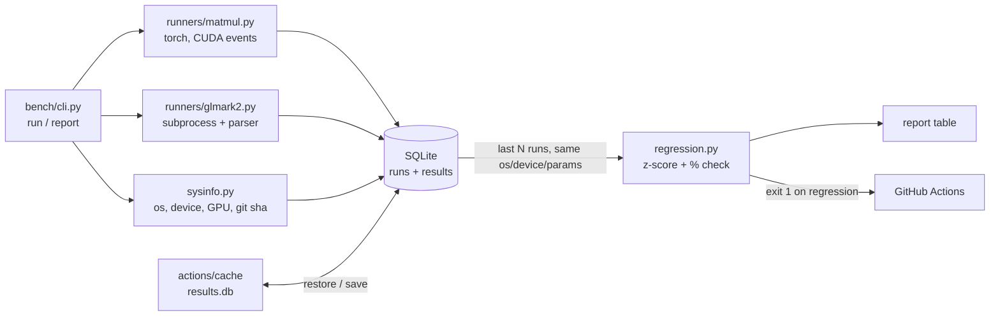

# gpu-bench

Small GPU/CPU benchmark harness with **statistical regression detection** and
CI integration. Every run is stored in SQLite; each new run is compared against
the last N runs on the same machine type, and the process exits non-zero (CI
goes red) when performance drops significantly.

| Benchmark | What it measures | Value stored | Noise indicator |
|-----------|------------------|--------------|-----------------|
| `matmul`  | PyTorch `n x n` matrix multiply (CUDA if available, else CPU), 20 timed repeats after 3 warm-ups | median GFLOP/s | CV = std/mean |
| `glmark2` | OpenGL scenes (`build`, `texture`, `shading`), 3 repeats, off-screen | median glmark2 score | CV = std/mean |

## Architecture



* **`runs`** – one row per invocation (timestamp, git SHA, OS, device, GPU name, torch version).
* **`results`** – one row per metric (`gflops_median`, `gflops_std`, `cv`, ...), plus
  `params` (JSON config such as `dtype`, `n`, `renderer`), raw `samples`, and a
  `status` (`ok` / `skipped` / `error` + reason).

## Running locally

```bash
python -m venv .venv && source .venv/bin/activate      # Windows: .venv\Scripts\activate
pip install -r requirements.txt                         # torch + pytest
# optional, Linux: sudo apt install glmark2   (Arch: pacman -S glmark2)

python -m bench.cli run                 # run all benchmarks, store in ./bench.db
python -m bench.cli run --report        # run + compare against history
python -m bench.cli report              # re-print report for the latest run
python -m bench.cli run --only matmul --n 4096 --repeats 30
pytest                                  # unit tests (no GPU needed)
```

Example report:

```
Run 14  2026-10-05T14:08:14+00:00  7c314eb  Linux/cuda  NVIDIA GeForce RTX 3060 Laptop GPU
Tolerance [local]: regression if z <= -3 and Δ <= -5% vs last 10 runs (min 3)

benchmark                          new  baseline      Δ%       z  status
----------------------------  --------  --------  ------  ------  ----------
matmul[dtype=float32,n=2048]   6875.31   9821.90  -30.00  -41.37  REGRESSION
glmark2                       11240.00  11302.50   -0.55   -0.48  ok
```

Useful options (accepted before or after the subcommand):
`--db PATH`, `--ci`, `--window N`, `--z Z`, `--pct P`, `--run ID` (report only),
`--inject-slowdown FACTOR` (run only, demo).

## How regression detection works

For each benchmark's primary metric (`gflops_median`, `score_median`; higher is better):

1. **Baseline** = the last `N = 10` successful runs with the **same OS, device and
   params** (a float64 run is never compared to float32 history).
2. Compute mean **μ** and sample std-dev **σ** of the baseline.
3. `z = (new − μ) / σ` and `Δ% = (new − μ) / μ · 100`.
4. **REGRESSION** only if **both** hold:
   * `z ≤ −3` — the drop is statistically unusual given past noise, **and**
   * `Δ% ≤ −X%` — the drop actually matters. This protects against a tiny σ
     (e.g. a very stable machine where a 1% blip is already "20σ").
5. Fewer than 3 historical runs → `not enough history`, nothing is flagged.

| Tolerance | z | X% | Why |
|-----------|---|----|-----|
| local (`LOCAL`) | 3 | 5%  | your own machine is fairly stable |
| CI (`CI`, auto when `$CI` is set or `--ci`) | 3 | 10% | shared cloud runners are noisy neighbours |

`cli.py report` prints the table and **exits with code 1 if anything regressed**.
Skipped/errored benchmarks are shown but don't fail the run.

The logic lives in [`bench/regression.py`](bench/regression.py) and is covered
by hand-computed tests in [`tests/test_regression.py`](tests/test_regression.py)
(e.g. history `[100, 102, 98, 101, 99]` → μ = 100, σ = √2.5; a result × 0.7 must be flagged).

## CI

[`.github/workflows/bench.yml`](.github/workflows/bench.yml) runs on every push
(Ubuntu + Windows): install deps → `pytest` → `bench.cli run --report`.

CI machines are thrown away after every job, so the SQLite file is carried
between runs with `actions/cache`: each job restores the newest
`bench-db-<OS>-*` entry and saves a new one under a unique key. Because a cache
is only saved when the job **succeeds**, a regressed run never becomes part of
the baseline. The DB is also uploaded as an artifact for inspection.

### Demo: forcing a regression

```bash
# locally
python -m bench.cli run --report --inject-slowdown 0.7 ; echo "exit=$?"   # -> exit=1
```

In CI, either set `BENCH_INJECT_SLOWDOWN: "0.7"` in the workflow `env` and push,
or use **Actions → bench → Run workflow** and enter `0.7`. After ≥ 3 green runs
have built up history, the job goes red:


### The CI / GPU limitation (honest version)

GitHub-hosted runners **have no GPU**. On them:

* `matmul` runs on the **CPU** (`device=cpu`), so it measures the runner's CPU, not a GPU.
* `glmark2` runs on **llvmpipe** (Mesa software rendering under `xvfb`); on Windows it is skipped.
* Runners are shared VMs, and consecutive jobs may land on **different CPU models**,
  so run-to-run noise is much higher than on a dedicated machine. That's why the CI
  tolerance is looser, and why CI here mainly proves the *pipeline* (storage,
  history, statistics, exit codes) rather than real GPU performance.
* A real *code* regression (e.g. a slower kernel) would still show up on CPU, but
  a GPU-driver or GPU-specific regression would not.

### Real GPU in CI: self-hosted runner (stretch goal)

Register your own GPU machine as a runner (repo **Settings → Actions → Runners →
New self-hosted runner**, follow the shown `config.sh` / `run.sh` steps), then add
a job such as:

```yaml
  bench-gpu:
    runs-on: [self-hosted, linux, x64]
    steps:
      - uses: actions/checkout@v4
      - run: python -m venv .venv && .venv/bin/pip install -r requirements.txt
      - run: .venv/bin/python -m bench.cli run --db "$HOME/gpu-bench/results.db" --report
```

On a self-hosted runner the DB can simply live on the machine's disk (no cache
needed), `device` becomes `cuda`, glmark2 uses the real GPU, and the stricter
local tolerance can be used. Only use self-hosted runners on **private** repos or
with restricted workflows — anyone who can open a PR could otherwise run code on
your PC.

## Project layout

```
bench/
  cli.py          run / report commands, table, exit codes
  db.py           SQLite schema, save_run, history
  regression.py   z-score + percentage check, LOCAL / CI tolerances
  sysinfo.py      os, device, GPU name, torch version, git sha
  runners/
    matmul.py     torch matmul GFLOP/s
    glmark2.py    glmark2 wrapper + output parser
tests/            pytest: parser, regression maths, CLI end-to-end
.github/workflows/bench.yml
```
